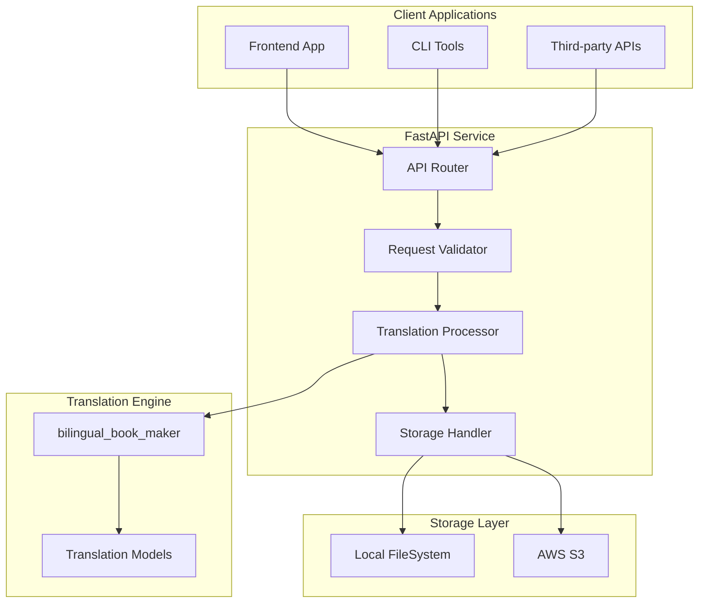

# EPUB Translation Service API Documentation

## Overview

The EPUB Translation Service is a FastAPI-based web service that wraps the `bilingual_book_maker` CLI tool to provide RESTful translation capabilities for EPUB files. The service supports both local development and production deployment with AWS S3 integration.

## Architecture Overview



## Base Configuration

**Base URL**:
- Local Development: `http://localhost:8000`
- Production: `https://your-domain.com`

**API Version**: `v1`

## Environment Configuration

The service behavior adapts based on the `STORAGE_MODE` environment variable:

- `STORAGE_MODE=local`: Local filesystem storage
- `STORAGE_MODE=s3`: AWS S3 storage for production

## Authentication

Currently, the API does not implement authentication. In production, consider adding:
- API key authentication
- JWT token validation
- Rate limiting per client

## Core API Endpoints

### 1. POST /translate

Uploads and translates an EPUB file. Behavior varies by environment.

#### Request

**Endpoint**: `POST /translate`

**Content-Type**: `multipart/form-data`

**Parameters**:

| Field | Type | Required | Description | Default |
|-------|------|----------|-------------|---------|
| `file` | File | Yes | EPUB file to translate | - |
| `target_language` | String | Yes | Target language code | - |
| `model` | String | Yes | Translation model to use | - |
| `openai_key` | String | Conditional | OpenAI API key (if using OpenAI models) | - |
| `claude_key` | String | Conditional | Claude API key (if using Claude models) | - |
| `gemini_key` | String | Conditional | Gemini API key (if using Gemini models) | - |
| `groq_key` | String | Conditional | Groq API key (if using Groq models) | - |
| `xai_key` | String | Conditional | xAI API key (if using xAI models) | - |
| `qwen_key` | String | Conditional | Qwen API key (if using Qwen models) | - |
| `caiyun_key` | String | Conditional | Caiyun API key (if using Caiyun) | - |
| `deepl_key` | String | Conditional | DeepL API key (if using DeepL) | - |
| `custom_api` | String | Conditional | Custom API endpoint (if using custom model) | - |
| `temperature` | Float | No | Model temperature (0.0-2.0) | 1.0 |
| `test` | Boolean | No | Test mode (translate only first 10 paragraphs) | false |
| `test_num` | Integer | No | Number of paragraphs for testing | 10 |
| `single_translate` | Boolean | No | Output only translated text (no bilingual) | false |
| `proxy` | String | No | HTTP proxy URL | - |
| `api_base` | String | No | Custom API base URL | - |
| `batch_size` | Integer | No | Lines per translation batch | - |
| `temperature` | Float | No | Model creativity (0.0-2.0) | 1.0 |
| `source_lang` | String | No | Source language (auto-detect if not specified) | "auto" |

#### Response

**Local Development Mode**:
```http
HTTP/1.1 200 OK
Content-Type: application/epub+zip
Content-Disposition: attachment; filename="translated_book.epub"

[Binary EPUB file data]
```

**Production Mode (S3)**:
```json
{
  "status": "success",
  "job_id": "uuid-4-format-job-id",
  "download_url": "https://your-bucket.s3.amazonaws.com/downloads/translated_book.epub?signed-params",
  "filename": "original_filename_translated.epub",
  "expiry": "2024-01-15T12:00:00Z",
  "message": "Translation completed successfully"
}
```

#### Error Responses

```json
{
  "error": "validation_error",
  "message": "Missing required API key for model 'chatgptapi'",
  "details": {
    "field": "openai_key",
    "required_for_models": ["chatgptapi", "gpt4", "gpt4omini", "gpt4o"]
  }
}
```

```json
{
  "error": "translation_error",
  "message": "Translation failed due to API rate limit",
  "details": {
    "provider": "openai",
    "error_code": "rate_limit_exceeded",
    "retry_after": 60
  }
}
```

```json
{
  "error": "file_error",
  "message": "Invalid EPUB file format",
  "details": {
    "file_type_detected": "application/pdf",
    "expected": "application/epub+zip"
  }
}
```

---

### 2. GET /models

Returns list of available translation models with metadata.

#### Request

**Endpoint**: `GET /models`

#### Response

```json
{
  "models": [
    {
      "id": "chatgptapi",
      "name": "GPT-3.5 Turbo",
      "provider": "openai",
      "requires_api_key": true,
      "api_key_field": "openai_key",
      "pricing": "paid",
      "description": "OpenAI's GPT-3.5 Turbo model",
      "supports_batch": true
    },
    {
      "id": "gpt4",
      "name": "GPT-4",
      "provider": "openai",
      "requires_api_key": true,
      "api_key_field": "openai_key",
      "pricing": "paid",
      "description": "OpenAI's GPT-4 model"
    },
    {
      "id": "claude",
      "name": "Claude 3",
      "provider": "anthropic",
      "requires_api_key": true,
      "api_key_field": "claude_key",
      "pricing": "paid",
      "description": "Anthropic's Claude 3 model"
    },
    {
      "id": "gemini",
      "name": "Google Gemini",
      "provider": "google",
      "requires_api_key": true,
      "api_key_field": "gemini_key",
      "pricing": "freemium",
      "description": "Google's Gemini model"
    },
    {
      "id": "groq",
      "name": "Groq",
      "provider": "groq",
      "requires_api_key": true,
      "api_key_field": "groq_key",
      "pricing": "freemium",
      "description": "Groq's fast inference models"
    },
    {
      "id": "google",
      "name": "Google Translate",
      "provider": "google",
      "requires_api_key": false,
      "pricing": "free",
      "description": "Google Translate (free)"
    },
    {
      "id": "deepl_free",
      "name": "DeepL Free",
      "provider": "deepl",
      "requires_api_key": false,
      "pricing": "free",
      "description": "DeepL free translation service"
    }
  ]
}
```

---

### 3. GET /languages

Returns list of supported target languages.

#### Request

**Endpoint**: `GET /languages`

#### Response

```json
{
  "languages": [
    {
      "code": "zh-hans",
      "name": "Chinese (Simplified)",
      "native_name": "简体中文"
    },
    {
      "code": "zh-hant",
      "name": "Chinese (Traditional)",
      "native_name": "繁體中文"
    },
    {
      "code": "en",
      "name": "English",
      "native_name": "English"
    },
    {
      "code": "es",
      "name": "Spanish",
      "native_name": "Español"
    },
    {
      "code": "fr",
      "name": "French",
      "native_name": "Français"
    },
    {
      "code": "de",
      "name": "German",
      "native_name": "Deutsch"
    },
    {
      "code": "ja",
      "name": "Japanese",
      "native_name": "日本語"
    },
    {
      "code": "ko",
      "name": "Korean",
      "native_name": "한국어"
    },
    {
      "code": "ru",
      "name": "Russian",
      "native_name": "Русский"
    },
    {
      "code": "pt",
      "name": "Portuguese",
      "native_name": "Português"
    },
    {
      "code": "it",
      "name": "Italian",
      "native_name": "Italiano"
    }
  ]
}
```

---

### 4. GET /download/{job_id}

**S3 Mode Only**: Downloads translated file by job ID.

#### Request

**Endpoint**: `GET /download/{job_id}`

**Path Parameters**:
- `job_id` (string): Unique job identifier returned from translation request

#### Response

**Success (Direct Download)**:
```http
HTTP/1.1 200 OK
Content-Type: application/epub+zip
Content-Disposition: attachment; filename="translated_book.epub"

[Binary EPUB file data]
```

**Success (S3 Redirect)**:
```http
HTTP/1.1 302 Found
Location: https://your-bucket.s3.amazonaws.com/downloads/job-id/translated_book.epub?signed-params
```

**Not Found**:
```json
{
  "error": "not_found",
  "message": "Job ID not found or file has expired",
  "job_id": "requested-job-id"
}
```

---

### 5. GET /health

Service health check and configuration information.

#### Request

**Endpoint**: `GET /health`

#### Response

```json
{
  "status": "healthy",
  "timestamp": "2024-01-15T10:30:00Z",
  "version": "1.0.0",
  "environment": "production",
  "storage_mode": "s3",
  "configuration": {
    "max_file_size_mb": 100,
    "supported_formats": ["epub"],
    "available_models": 12,
    "supported_languages": 50
  },
  "dependencies": {
    "bilingual_book_maker": "1.5.0",
    "fastapi": "0.104.1",
    "boto3": "1.29.0"
  }
}
```

## Error Handling

### Error Response Format

All errors follow a consistent format:

```json
{
  "error": "error_type",
  "message": "Human-readable error message",
  "details": {
    "additional": "context-specific information"
  },
  "timestamp": "2024-01-15T10:30:00Z",
  "request_id": "uuid-for-debugging"
}
```

### Common Error Types

| Error Type | HTTP Status | Description |
|------------|-------------|-------------|
| `validation_error` | 400 | Invalid request parameters |
| `file_error` | 400 | Invalid or corrupted file |
| `authentication_error` | 401 | Missing or invalid API keys |
| `translation_error` | 422 | Translation service failure |
| `storage_error` | 500 | File storage/retrieval failure |
| `rate_limit_error` | 429 | Too many requests |
| `internal_error` | 500 | Unexpected server error |

### Retry Logic

For transient errors (rate limits, temporary API failures):

1. **Rate Limit Errors**: Check `retry_after` header/field
2. **API Timeouts**: Exponential backoff: 1s, 2s, 4s, 8s
3. **Storage Errors**: Linear retry: 1s, 2s, 3s

## Configuration Options

### Environment Variables

#### Required
- `STORAGE_MODE`: `local` or `s3`

#### AWS S3 Configuration (when STORAGE_MODE=s3)
- `AWS_ACCESS_KEY_ID`: AWS access key
- `AWS_SECRET_ACCESS_KEY`: AWS secret key
- `AWS_REGION`: AWS region (e.g., `us-east-1`)
- `S3_BUCKET_NAME`: S3 bucket for file storage
- `S3_PRESIGNED_URL_EXPIRY`: URL expiry in seconds (default: 3600)

#### Optional API Configuration
- `MAX_FILE_SIZE_MB`: Maximum upload size in MB (default: 100)
- `TRANSLATION_TIMEOUT`: Translation timeout in seconds (default: 300)
- `TEMP_DIR`: Temporary file directory (default: `/tmp`)
- `LOG_LEVEL`: Logging level (default: `INFO`)

### File Size Limits

- **Maximum file size**: 100MB (configurable)
- **Supported formats**: `.epub` only
- **Processing timeout**: 300 seconds (configurable)

## Deployment Considerations

### Local Development

**docker-compose.yml**:
```yaml
version: '3.8'
services:
  epub-translator:
    build: .
    ports:
      - "8000:8000"
    environment:
      - STORAGE_MODE=local
      - MAX_FILE_SIZE_MB=50
      - LOG_LEVEL=DEBUG
    volumes:
      - ./temp:/tmp
      - ./downloads:/app/downloads
```

### Production Deployment

#### AWS ECS/Fargate

**Task Definition**:
```json
{
  "family": "epub-translator",
  "networkMode": "awsvpc",
  "requiresCompatibilities": ["FARGATE"],
  "cpu": "1024",
  "memory": "2048",
  "containerDefinitions": [
    {
      "name": "epub-translator",
      "image": "your-account.dkr.ecr.region.amazonaws.com/epub-translator:latest",
      "portMappings": [
        {
          "containerPort": 8000,
          "protocol": "tcp"
        }
      ],
      "environment": [
        {"name": "STORAGE_MODE", "value": "s3"},
        {"name": "AWS_REGION", "value": "us-east-1"},
        {"name": "S3_BUCKET_NAME", "value": "your-epub-storage-bucket"},
        {"name": "MAX_FILE_SIZE_MB", "value": "100"}
      ],
      "logConfiguration": {
        "logDriver": "awslogs",
        "options": {
          "awslogs-group": "/ecs/epub-translator",
          "awslogs-region": "us-east-1",
          "awslogs-stream-prefix": "ecs"
        }
      }
    }
  ]
}
```

#### IAM Permissions

**S3 Policy**:
```json
{
  "Version": "2012-10-17",
  "Statement": [
    {
      "Effect": "Allow",
      "Action": [
        "s3:GetObject",
        "s3:PutObject",
        "s3:DeleteObject"
      ],
      "Resource": "arn:aws:s3:::your-epub-storage-bucket/*"
    },
    {
      "Effect": "Allow",
      "Action": [
        "s3:ListBucket"
      ],
      "Resource": "arn:aws:s3:::your-epub-storage-bucket"
    }
  ]
}
```

### Load Balancer Configuration

**Application Load Balancer (ALB)**:
- **Health check path**: `/health`
- **Health check interval**: 30 seconds
- **Healthy threshold**: 2
- **Unhealthy threshold**: 3
- **Timeout**: 5 seconds

### Monitoring & Observability

#### CloudWatch Metrics
- Request count per endpoint
- Average response time
- Error rate by error type
- File processing duration
- S3 upload/download latency

#### Log Structure
```json
{
  "timestamp": "2024-01-15T10:30:00Z",
  "level": "INFO",
  "message": "Translation completed",
  "request_id": "uuid",
  "file_name": "book.epub",
  "model": "chatgptapi",
  "language": "zh-hans",
  "duration_seconds": 45.2,
  "file_size_mb": 2.5
}
```

## Rate Limiting & Performance

### Recommended Limits
- **Requests per minute per IP**: 10
- **Concurrent translations**: 5
- **File uploads per hour**: 50

### Performance Characteristics
- **Small EPUB (< 1MB)**: 30-60 seconds
- **Medium EPUB (1-5MB)**: 1-3 minutes
- **Large EPUB (5-20MB)**: 3-10 minutes

### Scaling Considerations
- **CPU-bound**: Translation processing
- **Memory usage**: ~500MB per active translation
- **I/O patterns**: Burst read/write during file processing
- **Network**: API calls to translation services

## Security Considerations

### Input Validation
- File type verification (magic number checking)
- File size limits
- EPUB structure validation
- Parameter sanitization

### API Key Handling
- Never log API keys
- Validate key format before use
- Rotate keys regularly
- Use environment variables only

### File Handling
- Sandboxed processing directory
- Automatic cleanup of temporary files
- Virus scanning (recommended for production)
- Content filtering for sensitive material

## Client Integration Examples

### JavaScript/TypeScript

```typescript
interface TranslationRequest {
  file: File;
  target_language: string;
  model: string;
  openai_key?: string;
  // ... other optional parameters
}

async function translateEpub(request: TranslationRequest): Promise<Blob | {download_url: string}> {
  const formData = new FormData();
  formData.append('file', request.file);
  formData.append('target_language', request.target_language);
  formData.append('model', request.model);

  if (request.openai_key) {
    formData.append('openai_key', request.openai_key);
  }

  const response = await fetch('/translate', {
    method: 'POST',
    body: formData
  });

  if (!response.ok) {
    const error = await response.json();
    throw new Error(error.message);
  }

  // Local mode returns file directly
  if (response.headers.get('content-type')?.includes('epub')) {
    return await response.blob();
  }

  // S3 mode returns JSON with download URL
  return await response.json();
}
```

### Python

```python
import requests
from typing import Union, Dict, Any

def translate_epub(
    file_path: str,
    target_language: str,
    model: str,
    api_key: str = None,
    base_url: str = "http://localhost:8000"
) -> Union[bytes, Dict[str, Any]]:

    with open(file_path, 'rb') as f:
        files = {'file': f}
        data = {
            'target_language': target_language,
            'model': model
        }

        if api_key:
            data['openai_key'] = api_key

        response = requests.post(
            f"{base_url}/translate",
            files=files,
            data=data
        )

    response.raise_for_status()

    # Check if response is binary (local mode)
    if response.headers.get('content-type', '').startswith('application/epub'):
        return response.content

    # JSON response (S3 mode)
    return response.json()
```

### cURL Examples

**Basic Translation**:
```bash
curl -X POST "http://localhost:8000/translate" \
  -F "file=@book.epub" \
  -F "target_language=zh-hans" \
  -F "model=chatgptapi" \
  -F "openai_key=sk-..." \
  --output translated_book.epub
```

**With Advanced Options**:
```bash
curl -X POST "http://localhost:8000/translate" \
  -F "file=@book.epub" \
  -F "target_language=zh-hans" \
  -F "model=chatgptapi" \
  -F "openai_key=sk-..." \
  -F "temperature=0.7" \
  -F "test=true" \
  -F "test_num=5" \
  --output translated_book.epub
```

**Get Available Models**:
```bash
curl "http://localhost:8000/models" | jq .
```

**Health Check**:
```bash
curl "http://localhost:8000/health" | jq .
```

This comprehensive API documentation covers all the essential aspects needed for both frontend developers consuming the API and DevOps engineers deploying the service. The documentation includes practical examples, error handling strategies, and production-ready deployment configurations.