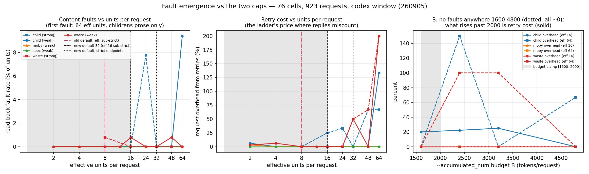
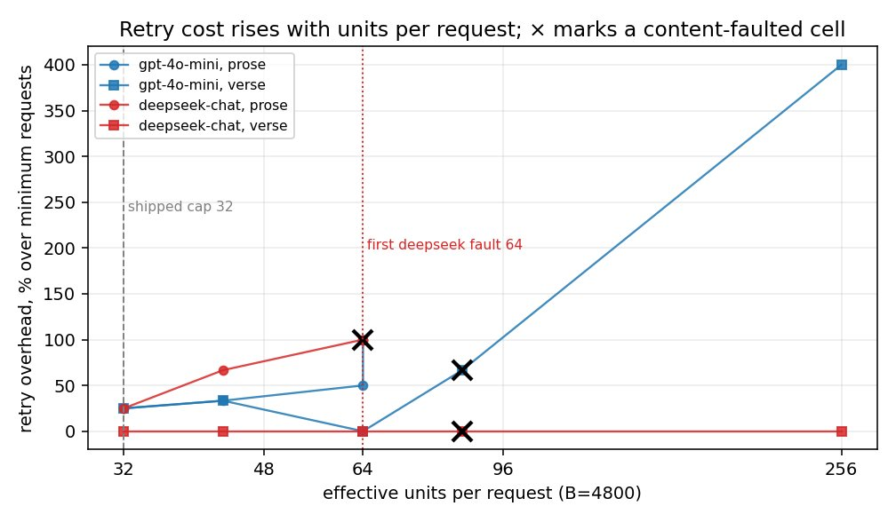
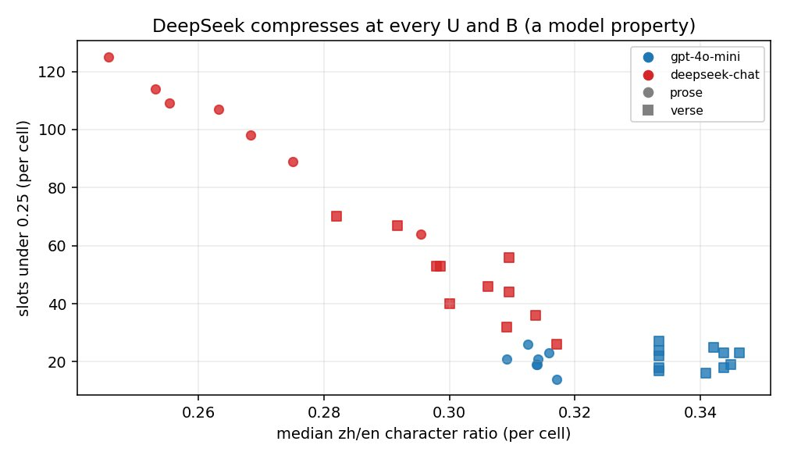

# 每次请求的单元数与 token 数：`--max-batch-units`、`--accumulated_num`

## 摘要

计划模式把若干单元（段落、诗行、单元格）放进一个请求。一个请求受两个上限约束：单元上限（`--max-batch-units`）和 token 预算（`--accumulated_num`）。两项付费研究考察了请求从哪里开始出错。一项在五个端点上做了 210 个请求的研究，发现所有请求级错误都出在 50 单元那一档。一项 923 个请求的扫描实验发现，第一个内容错误出现在每请求 64 个有效单元处，且只出现在文学散文上；在 1600 到 4800 token 的预算范围内，任何地方都没有错误。随附的默认值远低于这两者：16 个单元、1200 到 1600 token 的预算，在不校验严格 JSON schema 的端点上减半。**这些默认值是所有者设定的安全余量，不是测出来的最优值。** 测量表明，请求越大，每个译出的词越便宜；所有者选择了余量，放弃了这部分节省。

## 实验设置

**退化研究（2026 年 9 月 4 日）。** 210 个请求，5 个实验组，请求大小为 500、1000、2000、4000 和 8000 字符，每个请求最多 50 个单元。每种大小下各组的批次逐字节相同，由该分支自己的计划器从 childrens-literature、moby-dick、jlreq-in-english 和 mahabharata 构建。实验组：OpenAI 端点上的 `gpt-4o-mini` 和 `gpt-5.6-luna`，经转售商访问的 luna 和 `claude-sonnet-5`，以及经 OpenRouter 访问的 `deepseek-v4-flash`。错误按固定规则判定：尾部偷懒压缩、截断、数字保留。

**错误出现扫描（2026 年 9 月 5 日）。** Codex 路线上 76 个有效单元格、923 个请求：46 个预定单元格，加上一个 30 单元格的扩展（扩到 64、96 和 128 个单元）——因为发现这条路线自己的减半机制把网格限制在了 24 个有效单元。四本 epub-samples 书：childrens-literature（文学散文）、moby-dick-mo（长篇小说）、epub30-spec（短小的技术单元）和 wasteland（诗歌）。两个模型：`gpt-5.4-mini` 和 Codex 默认模型。每个单元格都从生成的 EPUB 中回读检查。内容错误指译文放错位置、译文缺失，或文本中残留标记。

**弱模型重跑**，在 `gpt-4o-mini` 和 `deepseek-chat` 上重跑了两个维度。它来自 2026 年 9 月的分组报告及下面的两张图；其逐单元格表格没有保留。

## 结果

退化研究，各组最大的无错请求大小：

| 实验组 | 最大无错档位 | 修正后的说明 |
|---|---|---|
| off-mini（官方 4o-mini） | 1000 | 2000 及以上有真实错误（见下） |
| off-luna（官方 luna） | **8000，全部无错** | 它触发的规则 4 是中文数字导致的误报 |
| rtr-luna（nianhuaapi luna） | **8000，全部无错** | 与官方唯一的差别：延迟为 2.4–6× |
| rtr-sonnet（nianhuaapi claude-sonnet-5） | 无 | 0/30 返回合法 schema 的 JSON——是传输格式问题，不是翻译问题 |
| or-deepseek（OpenRouter deepseek-v4-flash） | ~4000 | 另有原文回显错误（见下），补全 token 消耗 6.6×，最慢 |

- 尾部偷懒压缩从未触发（最差 88%，阈值 70%）。210 个请求中零截断。39 处未匹配的数字串里有 36 处是正确的中文数字。
- **rtr-sonnet 之外的所有请求级错误都出在 50 单元那一档。** 起约束作用的是单元数，而不是字符预算。
- 一次无声的尾部错位：`gpt-4o-mini`，8000 字符，50 个引文/出处交替的单元。ID 按顺序返回，但大约第 44 到 49 个位置的译文错位了一格。ID 回显发现不了这种情形。
- ID 回显抓到了它本来要抓的问题：一个 50 单元的 mahabharata 批次返回的 ID 只有 0 到 21，缺了 28 个段落，而端点报告的是成功。

错误出现扫描：

- **第一个内容错误出现在每请求 64 个有效单元处**，只在 childrens-literature 的散文上，占单元的 9.4%。moby、spec 和 wasteland 直到 64 都无错。Codex 默认模型在 24 个单元时的 7.8% 来自单独一个错位请求，在 32、48 和 64 时都无错。
- **带来风险的是每个请求的内容量，而不是单元数。** 48 个单元共 4705 个原文 token 无错；64 个单元共 3563 个 token 出错；64 个短行单元（600 到 1100 token）无错。
- **token 预算在 1600 到 4800 范围内都没有错误。** 超过约 2000 后上升的是重试成本：在 2400、单元数较大时，请求开销 +150%。
- 错位呈 U 形：两单元的批次在 4 本书中的 3 本上错位（无害；阶梯会降到单个单元），中间段大多无事，到 64 时重试又会错位。
- 扫描发现了一条真实的损坏路径：一次在对账后仍未被纠正的单格错位，把三个字面的 `⟦spanN⟧` token 写进了可见的正文。这已修复：这样的批次现在会沿减半阶梯下降，而不是被写入。

*图：错误率和重试成本随单元数与预算的变化，76 个单元格，923 个请求。线条表示当时的默认值（32 个单元，1600 到 2000 的预算），即 9 月 7 日裁定之前。*

弱模型重跑：调高单元上限，先付出的是重试，之后才是错误，所以该调低的是单元上限，而不是预算。

DeepSeek 在每种上限和预算下都压缩得很厉害（中/英字符比中位数 0.25 到 0.31，gpt-4o-mini 为 0.31 到 0.35）。这个模型上的译文偏短是模型本身的问题，不是分组错误。

*图：弱模型重跑，来自 2026 年 9 月的分组报告；其逐单元格表格没有保留。*

## 决定

9 月 5 日，扫描的负责人把上限设为 32（测得的错误出现点的一半），并出于重试成本的考虑保留了 2000 token 的预算上限。9 月 7 日，所有者调低了所有分组默认值：

| 常量 | 旧值 | 新值 |
|---|---|---|
| `GENERAL_GROUP_MAX_UNITS`（plan.py） | 32 | **16**（测得错误起点 64 单元的四分之一） |
| `SUBSTRICT_GROUP_MAX_UNITS` | 16（派生值 `//2`） | **8**（仍是派生值） |
| `substrict_batch_cap`（chatgptapi） | 16 | **8** |
| `SESSION_BUDGET_FLOOR` / `CEILING` | 2400 / 3200 | **1200 / 1600** |
| `SUBSTRICT_BUDGET_FLOOR` | 派生值 1200 | **直接写定 800**（有意不用 `floor//2`=600——不叠加两重余量） |

所有者记录在案的理由：schema 支持是端点的属性，不能证明模型会遵循指令；强模型在格式遵从上未必更好；而出错意味着模型无法把请求撑住。错位一格就是一本错书，而不只是一本贵书。所以安全余量优先于测得的按内容计算的节省（预算 800 时每个内容 token 折合 15.5 个输入当量，1600 时为 12.3）。

为什么在较弱的端点上减半：9 月 5 日的 JSON 对象评测发现的两次内容退步都是大批次，而没有严格 schema 判定的端点，无法与那种会出现回复计数错误的端点区分开来。所以在这种端点上，单元上限是 8，每请求预算是 800。

什么会改变它：重跑扫描，发现某个模型在 16 以下就出错（调低），或者所有者认为余量不如节省值钱（调高）。在那之前，运行打印 `misaligned batches this run` 时就调低 `--max-batch-units`；只为成本调高它，风险自负，而且绝不要超过 48。

## 局限

- **扫描中的“弱”模型是 `gpt-5.4-mini`，它不能代表弱模型。** 它在格式遵从上异常强。因此，扫描得出的“弱模型比强模型更能守住回复格式”（childrens 的 9 个单元格中 2 次恢复，对 6 个中 5 次）这一结论，对真正的弱模型来说未经证实。`gpt-4o-mini` 和 DeepSeek 的重跑才是弱模型的证据，而其逐单元格表格没有保留。
- 只有四本书，而且只有 childrens-literature 在 128 个单元时读到了正文；moby 和 spec 的测试片段都花在了前置内容上。
- 在本地模型上，16 到 64 个单元之间没有任何测量。
- token 预算只在 1600 及以上测得无错，而且只是在旧的 32 单元上限下。随附的 800 到 1600 有意落在测量范围之下。
