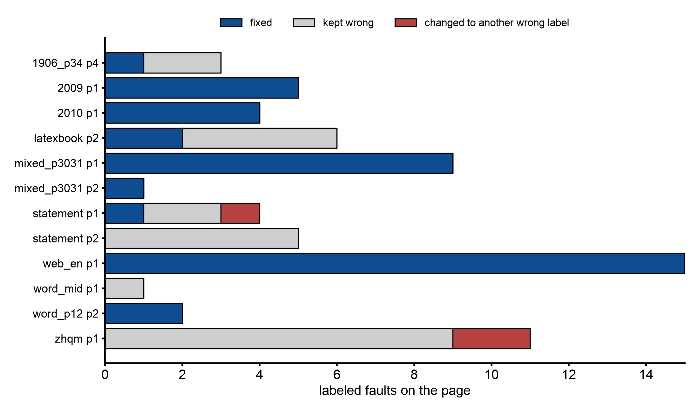

# 用图像模型判定区域角色：`--img-model`

## 摘要

docling 把每一页切分成区域（段落、标题、脚注、代码、表格、图片等），并排好阅读顺序。区域的角色或顺序一旦出错，书里就会显现出来：代码清单印成了脚注，第 2 节排在第 1 节前面，图题上方的插图不见了。这项研究在 85 页上整理了 docling 的错误目录，然后让一个视觉模型（gpt-5.6-luna）给它能看到的区域重新打标签。在原生数字页面上，模型修正了大部分错误标签。它修不了只有跨页才看得出的问题（页眉），也无法重建被 docling 打碎成碎片的页面。这些需要基于页面几何的规则，在任何模型之前运行。

角色校正已经实现：[PDF 路线](../features/pdf-to-epub.md#用视觉模型纠正区域角色)上的 `--img-model`。研究所要求的几何修复还没有实现，所以页眉和被打碎的页面仍按 docling 生成的样子输出。

## 实验设置

- docling 2.129.0，只用文本层（不做 OCR），在 43 个一到两页的切片上：共 85 页，其中 51 页 arXiv、16 页其他论文、4 页扫描件、14 页网页或 Word 页面。
- **错误目录：** 每一页都渲染出来，画出并标注区域，每个错误都由人工记录类别和严重程度（book-breaking 毁书级、visible 可见、minor 轻微）。
- **角色校正：** 12 页，每页至少有一个错误标签或页面装饰类错误。模型看到的是带标注的叠加图，以及区域 ID 列表，列出当前标签和前 80 个字符；它对每个 ID 回答一个标签，或 `abstain`。由脚本对照错误目录给答案打分；模型不自我评判。
- **整页探测：** 3 页，各缺一个区域。模型只看到干净的页面，返回带框的区域；以 IoU 0.5 及以上与 docling 的区域匹配。

## 结果

**错误目录：123 个错误，13 个毁书级。** 照抄自记录：

| fault_class | arXiv (26 sl/51 pp) | paper (8 sl/16 pp) | scan (2 sl/4 pp) | web (7 sl/14 pp) | total | book_breaking | visible | minor |
|---|---|---|---|---|---|---|---|---|
| wrong_label | 8 | 11 | 5 | 7 | 31 | 1 | 26 | 4 |
| paragraph_merge_split | 11 | 5 | 5 | 9 | 30 | 8 | 13 | 9 |
| column_order | 6 | 2 | 1 | 3 | 12 | 2 | 8 | 2 |
| heading_level | 0 | 6 | 0 | 5 | 11 | 0 | 1 | 10 |
| furniture_as_body | 2 | 1 | 3 | 4 | 10 | 0 | 8 | 2 |
| spurious_region | 7 | 2 | 0 | 0 | 9 | 0 | 3 | 6 |
| missing_region | 1 | 2 | 0 | 3 | 6 | 2 | 2 | 2 |
| caption_attachment | 2 | 2 | 0 | 2 | 6 | 0 | 4 | 2 |
| duplicate_asset | 1 | 0 | 0 | 3 | 4 | 0 | 0 | 4 |
| misplaced_asset | 1 | 0 | 0 | 1 | 2 | 0 | 2 | 0 |
| body_as_furniture | 0 | 1 | 0 | 1 | 2 | 0 | 1 | 1 |
| **all** | 39 | 32 | 14 | 38 | 123 | 13 | 68 | 42 |

错误标签是最常见的类别，但只毁掉过一次书。被打碎或错误合并的段落毁书 8 次：一个内嵌 OCR 层在一页上变成了 165 个区域，行内数学式被拆成 49 个单字形条目，一段代码清单丢掉了所有换行，还有 docling 的跨页合并把一个段落粘到了作者信息块上。

**缺失的文字不能用作触发条件。** 85 页中有 78 页，落在所有区域之外的文本层字符为 0.00%，任何一页最多也只有 1.23%。缺失的插图或公式没有文本层字符可缺。真正有效的信号是几何上的：孤立的图题、只装着编号的公式框、本该是表格的地方只有一条细长的图片。

**角色校正，12 页：**

| 页面 | 区域数 | 标签错误 | 已修正 | 保留了错误标签 | 改成了另一个错误标签 | 弃权 | 引入的错误 | 额外的正确修改 | 提示 / 补全（推理）token | 延迟 s |
|---|---|---|---|---|---|---|---|---|---|---|
| arxiv_1906_00495v1_p34 p4 | 17 | 3 | 1 | 2 | 0 | 0 | 0 | 0 | 3442 / 239 (157) | 5.6 |
| arxiv_2009_12164v1_p12 p1 | 13 | 5 | 5 | 0 | 0 | 0 | 0 | 1 | 3346 / 199 (130) | 5.7 |
| arxiv_2010_03667v1_p12 p1 | 20 | 4 | 4 | 0 | 0 | 0 | 0 | 1 | 3431 / 351 (254) | 7.6 |
| latexbook_p12 p2 | 11 | 6 | 2 | 4 | 0 | 0 | 1 (13:text->key_value_region) | 1 | 3190 / 520 (460) | 9.0 |
| mixed_photo_code_1_p3031 p1 | 17 | 9 | 9 | 0 | 0 | 0 | 0 | 0 | 2958 / 165 (84) | 6.0 |
| mixed_photo_code_1_p3031 p2 | 9 | 1 | 1 | 0 | 0 | 0 | 0 | 0 | 2739 / 150 (100) | 5.3 |
| statement_p12 p1 | 24 | 4 | 1 | 2 | 1 | 0 | 1 (18:text->key_value_region) | 1 | 3555 / 625 (512) | 6.0 |
| statement_p12 p2 | 9 | 5 | 0 | 5 | 0 | 0 | 0 | 0 | 3145 / 143 (94) | 3.5 |
| web_en_chrome_1_p12 p1 | 21 | 15 | 15 | 0 | 0 | 0 | 0 | 1 | 3308 / 619 (512) | 10.6 |
| word_en_table_1_mid p1 | 16 | 1 | 0 | 1 | 0 | 0 | 0 | 0 | 3451 / 265 (186) | 6.9 |
| word_en_table_1_p12 p2 | 5 | 2 | 2 | 0 | 0 | 0 | 0 | 0 | 3018 / 29 (0) | 2.7 |
| zhqm_mid p1 | 164 | 11 | 0 | 9 | 2 | 0 | 0 | 0 | 7860 / 1014 (345) | 9.5 |
| **合计（12 页）** | | 66 | 40 | 23 | 3 | 0 | 2 | 5 | 43443 / 4319 | 78.4 |

*上表 12 页中目录收录的标签错误，按模型的处理结果分类。共 66 个错误。*

- **66 个中修正了 40 个。** 除去银行对账单页面和 OCR 扫描件，是 46 个中的 39 个。
- **重复出现的页面装饰：8 个中修正 0 个。** 银行对账单反复出现的页头和监管声明块，在单独一页上看起来就像正文。只有它们跨页重复这一点才能把它们标识出来。
- **被打碎的 OCR 页面：11 个中修正 0 个。** 给碎片重新打标签并不能重建一页。
- **引入了 2 个错误**，都是 `text -> key_value_region`，危害很小。另有 5 处修改是正确的（文档标题）。模型从未弃权，连 164 个区域的那一页也没有。
- **成本：** 12 页共 43,443 个提示 token 和 4,319 个补全 token，每页 2.7 到 10.6 s。

**整页探测，3 页：** 模型找到了全部 3 个缺失的区域，标签也都正确（一张插图、一个带编号的公式、一张人口普查表）。它的框在 45 个区域中有 38 个与 docling 的匹配，平均 IoU 为 0.82 到 0.90，所以提出的框必须先吸附到页面自己的字形和图像边界上，才能从中裁剪任何东西。

**识别，推迟。** 表格：在 17 张表上，docling 的单元格 F1 为 0.888，模型为 0.854，其中 7 个标准答案按构造就等于 docling 的输出。docling 的公式解码在两页上跑了 27 分钟没有输出，被强行终止。

## 决定

这项研究得出的计划：

1. 几何修复最先运行，这不是模型的活：被打碎的行和段落、跨页合并、单字形碎条、代码换行，以及通过跨页重复找出的页面装饰。
2. 然后在清理过的区域 ID 上做角色校正。这是第一个模型步骤，因为它是代价最低的切入点，也是唯一测得有收益的一步。
3. 对缺失区域做整页提议，只在三个几何触发条件之一标记的页面上进行，框要吸附并检查。
4. 由模型判定阅读顺序尚未测试，仍是候选。表格和公式识别仍然推迟。

一次设计咨询（Codex，有记录）为第 2 步定下了约束：

- 在 OpenAI 风格的路线上加一个轻薄的图像适配层，复用现有的结构化输出阶梯；
- 角色修改是对条目的类型化替换，绝不是直接写标签；
- 页面装饰、表格、图片和列表不在第一轮范围内；
- 采纳的修改原子地应用；修改率异常的页面整页隔离，而不是削减（在首批真实运行后已改变，见下）；
- 每个判定都写入 `decisions.json` 以供审计；
- 默认关闭。

**实现了什么。** 第 2 步，即角色校正，先于几何修复实现。模型看到的是标注了 docling 区域的渲染页面，在严格的逐区域 schema 下，为每个符合条件的区域回答一个标签（text、section_header、title、caption、footnote、code 或 abstain）。符合条件的区域是正文、标题和小标题，且没有被任何图题或脚注引用、不在表格单元格和公式之内。列表、公式、表格、图片和页面装饰都不会被问到。采纳的回答会把条目替换成正确类型的条目，然后才运行公式和标题两个步骤。

首批真实运行，gpt-5.6-luna，四个测试样本的第 1-2 页，照抄自记录：

| 测试样本 | 询问 | 采纳（已应用） | 保留 | 拒绝 | 隔离页数 | 调用次数 | 提示 / 补全 token | 秒 |
|---|---|---|---|---|---|---|---|---|
| arxiv_2010_03667v1 | 27 | 6 | 21 | 0 | 0 | 2 | 7001 / 368 | 9.9 |
| web_en_chrome_1 | 28 | 4 | 24 | 0 | 0 | 2 | 6930 / 365 | 8.8 |
| mixed_photo_code_1_p3031 | 15 | 1（另有 9 个被隔离） | 5 | 0 | 1 | 2 | 5538 / 177 | 6.2 |
| arxiv_1706_03762（留出样本） | 21 | 2 | 19 | 0 | 0 | 2 | 6645 / 322 | 7.8 |

隔离机制挡掉了它遇到的唯一一个毁书级修正：在那一页代码上，模型 10 个回答中对了 9 个，这超过了 60% 的修改阈值。于是所有者去掉了隔离。现在，所询问条目中超过 60% 被修改的页面会保留修改，并打印 `Region roles: … on page N changed; read that page in source.md before translating.` 去掉隔离后重跑，那八行清单导出为代码（八个独立的代码块，因为相邻的代码条目还不会合并）。留出的那篇论文，Markdown 中改动的行数为 0。

**图像模型需要明确选择。** 这一步只在你指定的模型上运行，通过 `--img-model` 或提供方条目的 `img_model`。翻译模型永远不会被退而用于图像（所有者裁定），所以没有哪个默认设置需要能读图的模型。随附的 `openai` 提供方条目写的是 gpt-5.6-luna，所以 `--provider openai` 会开启这一步；`--img-model none` 关闭它。这一步之前，会用一张图片探测模型能否看到图片；不能的话，保留 docling 的标签。

**本地模型：** 每页约 3,000 个提示 token 不算多，但 164 个区域的那一页用了 7,860 个，这超出了 8B 级模型的能力。用 `--img-base-url` 把这一步指向托管的视觉模型，或者干脆关掉。

## 局限

- 角色校正只在 12 页上测量，整页探测只有 3 页。记录中“错误类别对应修正”的表格只是一个方向，不是比率。
- 错误目录由一名工作者根据叠加图整理；arXiv 上的标题层级没有评判（另有一项研究专门覆盖它们）。
- 只运行了一个模型（gpt-5.6-luna）。没有尝试任何本地模型。
- 已实现的这一步只在四个测试样本的第 1-2 页上检查过；像 text 改成 footnote 这类只改标签的修改，目前在导出中还不产生任何变化。
- 错误目录中没有运行任何 OCR 引擎；两份扫描件是通过它们内嵌的文本层读取的。
