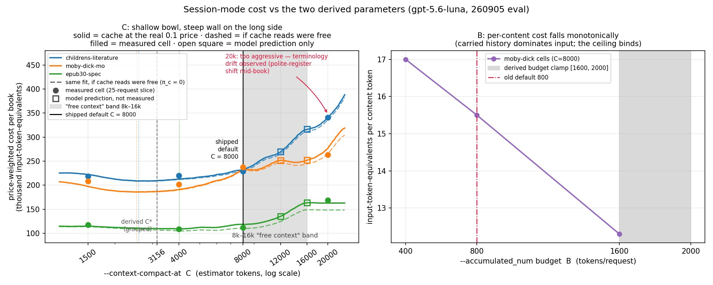
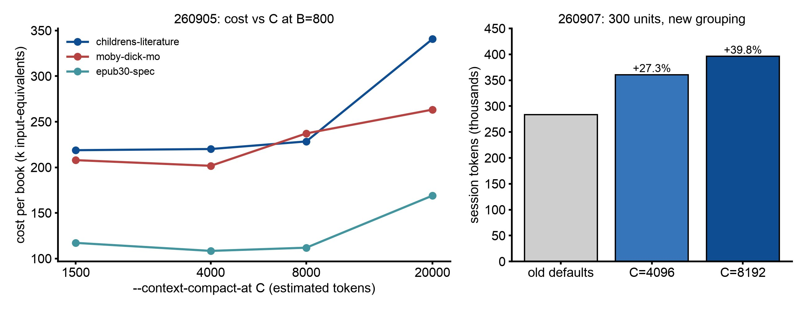

# 会话压缩预算：`--context-compact-at`

## 摘要

在会话模式下，历史不断增长，直到达到 `--context-compact-at`，然后模型写一份交接报告，开启一个新窗口。预算短意味着接缝多；预算长意味着每个请求都要重读很长的历史。一项在三本书上做的 18 次付费运行研究，测量了成本随预算的变化。曲线在 1500 到 4000 之间是平的，之后上升，到 20000 时急剧上升。在 2500 的预算下，44 道接缝处的连续性都保持住了。9 月 7 日分组默认值减半之后，第二次测量发现 8192 的成本比 4096 **更高**：在一次 300 单元的运行中，相对旧默认值分别为 +39.8% 和 +27.3%。**默认值仍然保持 8192，是为了连续性，而不是价格。** 更低的值才是便宜的设置。

## 实验设置

**成本研究（2026 年 9 月 5 日）。** 18 次付费运行，OpenAI 端点上的 `gpt-5.6-luna`，共 3.267M token，`--language zh-hans`，`--use_context session`，每个单元格的规模约为 25 个请求。三本 epub-samples 书：childrens-literature（人名反复出现的文学散文）、moby-dick-mo（长章节）和 epub30-spec（短小、重复的技术单元）。

| 阶段 | 单元格 | 测量内容 |
|---|---|---|
| 0 | 3 本书，出厂默认值 | 校准：每请求开销 F、JSON 包装 j、交接提示 F_h、报告大小 K |
| 1 | C ∈ {1500, 4000, 8000, 20000} × 3 本书，B=800 | 成本随 C 变化的曲线 |
| 2 | moby-dick 上 B ∈ {400, 1600}（800 取自阶段 1） | 成本随 B 变化的曲线 |
| 3 | 一整本书，用解出的最优值（B=1088, C=2500） | 样本外验证 |

成本以输入 token 当量表示：`(tokens_in − tokens_cached) + 0.1·tokens_cached + 4.0·tokens_out`，即厂商的价格比例。当时的计量没有统计压缩轮次本身（在 C=1500 时最多占真实成本的 38%；此后已修复），所以每个总数都是计量成本加上重建的压缩轮次。

**新默认值的价格核查（2026 年 9 月 7 日）。** animal_farm，`gpt-5.6-luna`，会话模式，300 和 150 个单元，新的分组（16 个单元，预算 1200 到 1600）在 C=4096 和 C=8192 下，对照 9 月之前的默认值（预算 2400 到 3200，C=8000）。

## 结果

9 月 5 日，每本书按价格加权的总成本：

| 书 | C=1500 | C=4000 | C=8000 | C=20000 | 解出的 C* |
|---|---|---|---|---|---|
| childrens-literature | **218.8k** | 220.1k | 228.4k | 340.7k | 2512 |
| moby-dick-mo | 207.9k | **201.7k** | 237.2k | 263.3k | 2191 |
| epub30-spec | 117.2k | **108.4k** | 111.9k | 169.0k | 1580 |

- 三本书在 1500 到 4000 之间都平坦，差异在 0.6 到 3% 以内；三个解出的最优值都落在这一段。
- 结果记录认为 8000 比平坦区域高 4 到 18%。之后根据同样的单元格写成的分组报告认为，它比每本书自己的最优值高 9 到 25%。两者描述的是同样的运行，只是对照的基线不同。
- C=20000 的成本最多高出 56%，也是唯一出现漂移的单元格：在一个长窗口内，称谓从“你”变成了“您”。
- **短窗口下连续性依然保持。** C=2500 的整本书运行跨过 44 道接缝，1012 个节点中术语零断裂（皇帝 62/62，夜莺 38/38，公主 34/34，安徒生 12/12）。交接报告起到了不断累积的人名表的作用。
- 曲线背后的模型准确预测了整本书运行的请求数（82/82），成本预测误差在 −6.2% 以内。那次运行每个内容 token 的成本（11.7）低于网格中的每一个单元格（13.1 到 20.4）。
- 拟合常数：F=104，每单元 j=11.3，F_h=72，K=538（139 份报告），ρ 为 1.41 到 1.74，各书 g 为 1245/920/645，r 为 1.12 到 1.18，α 随 C 上升（childrens 上为 0.042 到 0.213）。

*图：9 月 5 日的成本模型与单元格。图中标出的是当天的默认值（C=8000，预算限定在 1600 到 2000），即 9 月 7 日裁定之前。12000 和 16000 处的空心方块是模型预测。*

9 月 7 日，新分组默认值的价格：

| 实验组 | 300 单元的请求数 | 全部 token | 压缩次数 |
|---|---|---|---|
| 旧默认值 | 33 | 283,361 | 8 |
| 新上限，C=4096 | 63 | 360,681 (+27.3%) | 19 |
| 新上限，C=8192 | 52 | 396,197 (+39.8%) | 9 |

150 个单元时：4096 为 +5.9%，8192 为 +24.0%。把 C 从 4096 提高到 8192，如预期那样让压缩次数回到了旧水平（19 降到 9，旧值为 8），账单却更高了。减半的预算让请求数成倍增加（33 变成 52 或 63），而每个请求都要重读携带的历史：每请求的提示负载分别为 7007（旧）、4690（4096 时）和 6537（8192 时）。缓存没能挽回：约 340k 的提示中只有 9k 到 21k token 被缓存。

*图：9 月 5 日的成本模型（左）和 9 月 7 日的价格核查（右）。脚本：`docs/img/src/session_compact_cost.py`。*

## 决定

`--context-compact-at` 在每次会话运行中默认都是 **8192**，不论是否分组，Codex 路线也一样。运行开始时会打印它。

理由是连续性，照顾的是在本地设备模型上运行本工具的众多用户，他们的成本曲线并不是这里测得的托管、带缓存的那一条。它**不是**便宜的设置。在当前的分组预算下，更低的值更便宜：300 个单元时，4096 用了 360,681 token，8192 用了 396,197。超过 16000 后成本急剧上升，而唯一观察到的漂移就出现在长窗口的单元格里。

什么会改变它：在变化后的分组预算下重新测量这两个单元格（4096 和 8192），或者在本地模型上做一次连续性测量。不重跑这两个单元格，就不要改动其中任何一个数字。

对你来说：不设置它，接缝最少。如果会话成本比接缝更要紧，就把它调低（往 4096 靠）。如果模型的输入上限更小，就设为那个上限。最小值是 1500。

## 局限

- 只有一个模型（`gpt-5.6-luna`），在一个带提示缓存的端点上。没有测量无缓存端点和本地端点。
- 每个单元格只是一次约 25 个请求的运行；单次运行上约 30% 以内的差异接近噪声。
- 9 月 7 日的价格核查只用了一本书（animal_farm）的两种规模。
- 连续性结论只基于一整本书（childrens-literature，zh-hans）。
